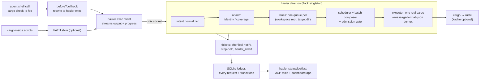

# cargo-hauler

cargo-hauler is an [agent-bundle](https://github.com/ScriptedAlchemy/agent-bundle)
plugin that puts a broker daemon between coding agents (Claude Code, Codex CLI,
Cursor) and `cargo`. A `beforeTool` hook rewrites each agent's cargo shell call
into a brokered request; the daemon deduplicates, schedules, and executes the
work, then streams output back so the agent sees a normal cargo run.

Agents keep running plain `cargo …`; the broker does the rest.

## The problem

Mined from Cursor/Codex/Claude session archives for one 49-crate Rust
workspace, Jun–Aug 2026:

- ~73,000 agent cargo invocations, all sharing one target dir across worktrees.
- ~45,600 "Blocking waiting for file lock" events; peak 33 concurrent cargo
  processes; 91% of Cursor cargo runs started while another was in flight.
- Massive redundancy: Cursor alone re-ran 12,783 identical command+cwd pairs
  within 15 minutes — 96% of them near-simultaneous parallel-subagent
  duplicates of a run already in flight.
- The work is slow enough to matter: check p50 ~3 min, build p50 ~11 min.
  Claude's shell tool killed 106 builds at its hard timeout, some of which
  were passing.
- Agents hand-rolled mitigations that make it worse: `CARGO_TARGET_DIR`
  isolation on 29% of commands (defeats sharing), 6,197 `ps`/`pgrep` probes,
  87+ `pkill cargo`.

The broker replaces lock contention with a queue, duplicate runs with
attachment, and blind waiting with tickets and status surfaces.

## How it works



Every request is normalized into an intent (subcommand, package set, targets,
features, profile, toolchain, env digest, workspace root, resolved target
dir), ledgered, and then served one of three ways:

- **Attach.** A request whose normalized intent is byte-identical to an
  in-flight run becomes a follower: the leader's buffered output is replayed,
  live output is mirrored, and the exit is shared — this is aimed at the 96%
  duplicate storm. A strictly weaker `cargo check` can also ride a stronger
  in-flight `build`/`check` over the same compile surface and a covering
  package set (coverage riding), with only the diagnostics for its own scope.
- **Merge.** The batch composer folds queued compatible `check`/`build`/
  `clippy` requests with explicit `-p` lists into the leader's single cargo
  invocation (up to 16 packages). The executor runs cargo with
  `--message-format=json-diagnostic-rendered-ansi` and demultiplexes per-unit
  results back to each requester. Riders with `--lib`-scoped demands are
  released early, as soon as the stream proves their packages compiled cleanly
  (or shows them failing); broader demands settle with correct per-scope
  results when the composite run completes. Test runs fold too: when a slot
  opens, queued compatible `cargo test` requests in the same lane become one
  composite run — the union of their `-p` packages and `--test` targets, the
  union of their trailing libtest filters (dropped entirely if any participant
  had none, so the composite always runs a superset), with `--no-fail-fast`
  added so one crate's failure still surfaces the others' results.
  `cargo nextest run` requests fold through `-E '(expr1) or (expr2)'` filter
  expressions; a participant without `-E` contributes `package(...)`
  expressions built from its `-p` flags. Unlike compile demux, folded test
  participants share the composite's full output and exit code: a failure
  anywhere fails everyone.
- **Queue and run.** One lane per (workspace root, target dir) — the daemon is
  the only cargo runner on managed paths, which alone ends the lock storms. A
  cost scheduler picks the next job by score: shortest-job-first, divided by
  waiter fan-out (runs that release the most agents win) and topological
  unblocks (leaf crates before their dependents, warming the artifacts the
  dependents reuse), halved for recently-edited crates (fail fast), and decayed
  by age (every 30s waited halves the effective score, so broad builds are
  never starved). Estimates come from the daemon's own per-intent EWMA, seeded
  from ledger history, falling back to kache `index.db` per-crate compile-time
  priors when kache is installed, then to mined-p50 defaults. Admitted runs
  get a `CARGO_BUILD_JOBS`
  grant that splits the machine's cores between them, and a machine-wide
  admission gate caps concurrent cargo processes (default 5).

## Tickets and long builds

Every request gets a durable ticket (`cc-<n>`) in the SQLite ledger; results
(status, exit code, output tail, timings) survive daemon restarts and are
retrievable cross-session.

- `hauler exec --bg -- cargo …` (or the `hauler_request` MCP tool)
  returns the ticket immediately.
- Sync runs auto-background when the priors-based ETA exceeds the host's
  shell-timeout cap (~9 min for Claude, 10 for Codex, 14 for Cursor), instead
  of getting killed mid-build.
- The `afterTool` hook notifies: on the agent's next tool call after a ticket
  finishes, it injects context like `ticket cc-42 finished: success, 0 errors —
  call hauler_result cc-42`.
- `hauler_await <ticket>` long-polls; `hauler_result <ticket>` fetches
  the durable result.
- Stop-hold: when an agent tries to stop with pending tickets, the `stop` hook
  waits up to min(remaining ETA, `CARGO_HAULER_STOP_WAIT_MS`) and then
  denies the stop — with the result summary if something finished, otherwise
  with status + ETA and an escape hatch ("stop again to keep waiting or call
  hauler_await"). The re-deny loop makes the total wait unbounded without
  any marathon hook process; `stopHookActive` plus a per-ticket deny cap (8)
  prevents livelock. Background tickets never hold the stop.

## Install

Works on Linux and macOS. Windows is experimental and untested: the daemon
resolves a `\\.\pipe\` named pipe instead of a unix socket and the jobserver
degrades to disabled, but the cargo PATH shim is a POSIX shell script and
`install-shim` refuses to install it there. Requires Node >= 22.19
(`node:sqlite` without native deps).

### The first five minutes

Build the bundle once (`npm install && npm run build`); `artifact/plugin` is
the installable multi-host bundle. Then install per host:

- **Claude Code**:

  ```sh
  claude plugin marketplace add ./artifact/plugin
  claude plugin install cargo-hauler@cargo-hauler-marketplace
  ```

- **Codex CLI**:

  ```sh
  codex plugin marketplace add ./artifact/plugin
  codex plugin add cargo-hauler@cargo-hauler-marketplace
  ```

- **Cursor** — run the install script (Cursor's local-plugin loader needs
  root manifests the artifact does not carry, so a bare symlink is not
  enough), then restart Cursor so new sessions pick up the hooks:

  ```sh
  ./scripts/install-cursor.sh
  ```

Verify the daemon with the `hauler` CLI that ships in the artifact
(`node artifact/plugin/scripts/hauler.mjs`, abbreviated `hauler` below):

```sh
hauler daemon start
hauler daemon status
```

The first brokered request auto-spawns the daemon too, so this step just
confirms the wiring. The dashboard is an MCP App
(`ui://cargo-hauler/dashboard.html`) rendered by the `hauler_status`
tool inside MCP App-capable hosts; to see it in a plain browser, run
`node scripts/preview-dashboard.mjs` (see [Development](#development)).

**Optional PATH shim** — hooks cannot see cargo spawned inside shell
scripts; the shim catches those:

```sh
hauler install-shim --dir ~/.local/bin
```

The generated shim embeds absolute paths for both the hauler CLI and the
real cargo (resolved at install time, never through PATH again), tags its
submissions with `--host shim`, and passes daemon-spawned cargo straight
through to the real binary so the broker never re-enters itself.

See [docs/install.md](docs/install.md) for per-host hook details and Codex
specifics.

## kache is optional

The broker never requires kache. Without it, scheduling estimates come from
the daemon's own EWMA over ledger history (plus mined-p50 defaults for
never-seen intents) and the dashboard
simply omits the machine-wide cache panel. With kache installed, its
`index.db` seeds per-crate compile-time priors, so the very first run of an
intent gets a real estimate instead of a default. A missing index is reported
as "kache unavailable", never an error.

## Surfaces

The `hauler` CLI ships inside every host artifact (`scripts/hauler.mjs`)
and as the package bin:

| Command | What it does |
| --- | --- |
| `hauler exec [--session ID] [--host HOST] [--cwd DIR] [--bg] -- <cargo …>` | Run cargo through the daemon, streaming output back (the hook rewrites to this form) |
| `hauler status [--limit N]` | Queue, in-flight work, lanes, admission |
| `hauler log [--limit N]` | Recent requests from the durable ledger |
| `hauler last` | The most recent request |
| `hauler await <ticket> [--max-wait-ms N]` | Long-poll a ticket until it finishes or the wait expires |
| `hauler result <ticket>` | Fetch a durable ticket result |
| `hauler request [--session ID] [--cwd DIR] -- <cargo …>` | Submit a background request, returning a ticket |
| `hauler daemon <run\|start\|stop\|status>` | Daemon lifecycle |
| `hauler install-shim [--dir DIR] [--real-cargo PATH] [--force]` | Install the optional PATH cargo shim |

The same operations project to MCP tools on the `hauler` server:

| MCP tool | What it does |
| --- | --- |
| `hauler_status` | Daemon queue and in-flight work (renders the dashboard widget) |
| `hauler_log` | Recent requests from the ledger |
| `hauler_last` | The most recent request |
| `hauler_await` | Long-poll a ticket |
| `hauler_result` | Fetch a durable ticket result |
| `hauler_request` | Submit a background cargo request |

The MCP App dashboard (`ui://cargo-hauler/dashboard.html`, bound to
`hauler_status`, loaded immediately and then refreshed every 5s) stacks
full-width sections in the order contention → in flight → queue → lanes →
history. Contention shows daemon state, queue depth, and an admission meter.
In-flight and queued rows show the workspace, who submitted (host · session),
and elapsed or waiting time against the cost-model estimate
("2m 18s / ~13m 11s"). Lanes lists only lanes with work — queued or running —
counted as "3 active · 7 seen"; idle lanes clear on daemon restart. History
lists only finished (done, failed, or killed) runs, including what each
request actually ran as when the batch composer expanded it. Commands render
the bare program name (`cargo test …`) with the full binary path in the hover
tooltip. Status and log surfaces keep working from the ledger when the daemon
is down.

## Configuration

All settings are environment variables read by the daemon (and hooks):

| Variable | Default | Meaning |
| --- | --- | --- |
| `CARGO_HAULER_STATE_DIR` | per-user cache dir (see below) | Home of the unix socket, SQLite ledger, daemon log, pid lock, and `hook-events.jsonl` |
| `CARGO_HAULER_CARGO_BIN` | `$CARGO_HOME/bin/cargo` | Real cargo binary for daemon-spawned work (bare `cargo` as last resort); the daemon never resolves `cargo` through PATH, where the shim may sit |
| `CARGO_HAULER_MAX_CONCURRENT` | `5` | Machine-wide cap on concurrently running cargo processes (admission permits) |
| `CARGO_HAULER_REPLAY_BUFFER_BYTES` | `4194304` | Leader output retained in memory for late-attacher replay |
| `CARGO_HAULER_KACHE_INDEX` | kache's own configured store (see below) | kache index for per-crate compile-time priors (empty string disables; a missing file just reports kache as unavailable) |
| `CARGO_HAULER_JOBS_GRANT` | `max(4, cores / max concurrent)` | `CARGO_BUILD_JOBS` injected into each spawned cargo (`0` disables; caller-set `-j`/env wins) |
| `CARGO_HAULER_BATCH` | enabled | Set to `0` to disable the batch composer |
| `CARGO_HAULER_BATCH_WINDOW_MS` | `150` | Brief hold for a batchable lane head so near-simultaneous agent requests can fold (`0` disables) |
| `CARGO_HAULER_STOP_WAIT_MS` | `30000` | Bounded wait per stop-hold hook invocation |

Daemon state defaults to a per-user cache directory: `$XDG_CACHE_HOME/cargo-hauler`
when `XDG_CACHE_HOME` is set, otherwise `~/.cache/cargo-hauler` on Linux,
`~/Library/Caches/cargo-hauler` on macOS, and `%LOCALAPPDATA%\cargo-hauler`
on Windows. Set `CARGO_HAULER_STATE_DIR` to move it (e.g. onto a RAM disk);
no machine-specific mount is ever required.

When `CARGO_HAULER_KACHE_INDEX` is unset, the kache index resolves to
`<local_store>/index.db` where `local_store` is read from kache's own config
(`$XDG_CONFIG_HOME/kache/config.toml`, else `~/.config/kache/config.toml`,
`[cache]` section); if no config exists, it falls back to
`<user cache>/kache/index.db` under the same cache base as above. kache is
optional either way — see [kache is optional](#kache-is-optional).

## Guarantees and caveats

- **Fail-open everywhere.** Hook errors pass the original command through; if
  the daemon is unreachable the client tries to auto-spawn it once, then runs
  cargo directly (passthrough). Missing kache data or topology failures
  degrade to defaults, never to errors.
- **Test sharing is identity or fold, never coverage.** `test`/`nextest`/
  `bench` coalesce between byte-identical runs, and queued compatible `test`/
  `nextest` requests can fold into one composite run whose full output and
  exit code every participant shares — a failed ticket can mean a co-batched
  crate's tests failed, not yours, so read the composite output before
  re-running. Coverage riding stays limited to `check` under an in-flight
  `build`/`check`.
- **Failed-stronger rule (compile work).** A failed or killed stronger run
  never satisfies a coverage or compile-batch follower — the follower is
  requeued to run on its own. The one exception is proven per-unit success:
  if the JSON stream shows the follower's packages compiled cleanly before an
  unrelated unit failed, the follower is released as done. Folded test
  participants sit outside this rule by design: they share the composite's
  exit code.
- **Denied and attempted runs are recorded.** Hook rewrites and policy denials
  (`cargo clean` while builds are in flight) append to `hook-events.jsonl`
  under the state dir; malformed cargo commands get a failed ledger row.
- **Codex stop-hook behavior is verified on Codex 0.147.0** (live probe:
  holds of ~29s and ~72s ran to their own wait bound and denied intact; hook
  trust must be granted or bypassed for hooks to run at all). Budgets above
  ~72s are plausible but unmeasured; the bounded-wait design tolerates being
  cut off either way. See [docs/codex-hooks.md](docs/codex-hooks.md).
- Requires Node >= 22.19 (`node:sqlite` without native deps). Linux and macOS
  only for now — Windows lacks the unix socket, shell shim, and POSIX fifo
  the daemon relies on. Daemon state lives under the per-user cache dir by
  default (`CARGO_HAULER_STATE_DIR` overrides; see
  [Configuration](#configuration)).

## Development

```sh
npm run dev     # agent-bundle workbench with live rebuilds (portable target)
npm run check   # validate + build + typecheck + rstest — the merge gate
```

### Preview the dashboard in a browser

```sh
node scripts/preview-dashboard.mjs --port 4941
```

Serves the built dashboard (`artifact/plugin/mcp-apps/dashboard.html`) at
`http://127.0.0.1:4941` outside any MCP host: a small harness answers the
widget's MCP App messages with live `hauler status` output, so the page
shows real daemon data with the same 5s polling. Run `npm run build` first —
the harness reads the artifact, not the sources.

`repos/effect` vendors the Effect v4 source (subtree pinned to
`effect@4.0.0-rc.112`) as read-only reference for coding agents — it is not a
runtime dependency; see `AGENTS.md`.

agent-bundle has no npm release yet; this repo pins the
[pkg.pr.new](https://pkg.pr.new) preview of main SHA
[`560124af`](https://github.com/ScriptedAlchemy/agent-bundle/commit/560124af).
Compile targets are `plugin` (one bundle for Claude, Codex, and Cursor) and
`portable` (workbench playground); see `agent-bundle.config.ts` for why the
per-host target names are not listed individually (AB6017).
