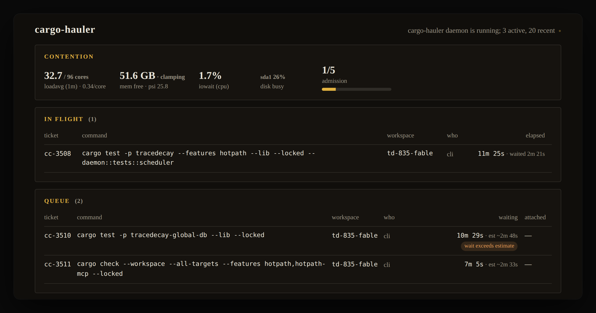
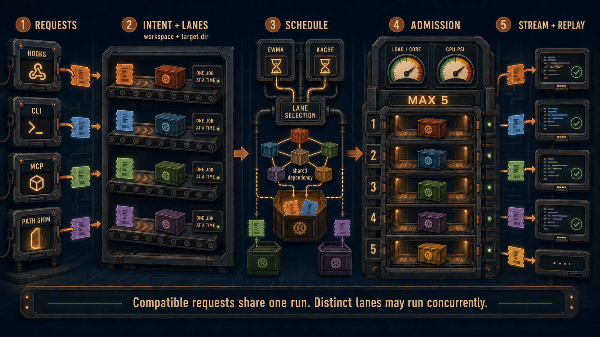
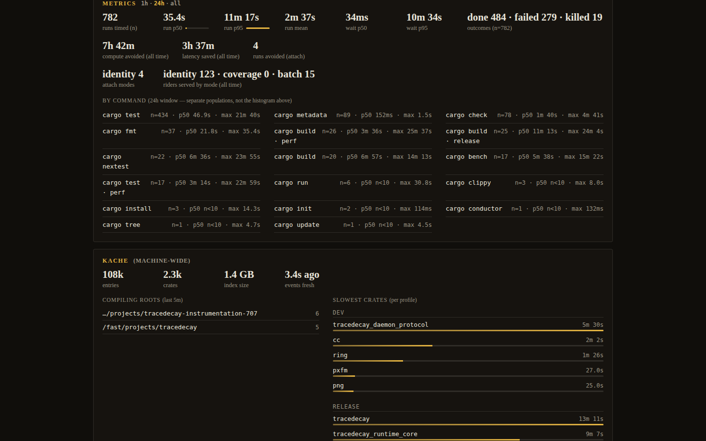
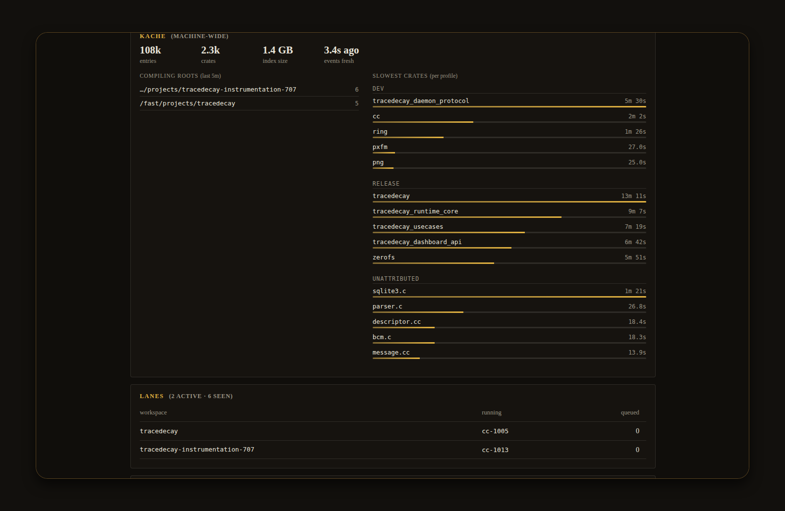
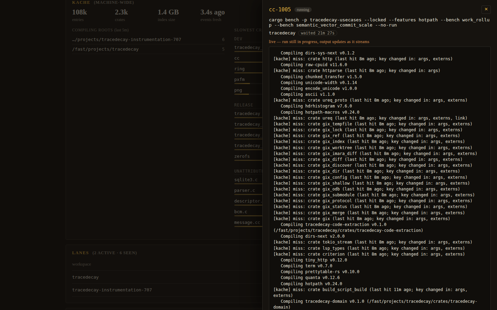

<p align="center"></p>

# cargo-hauler

Cargo request broker for concurrent Rust development tools.

cargo-hauler accepts Cargo requests from Claude Code, Codex, Cursor, scripts,
and terminals. A daemon groups compatible work, limits process concurrency,
and returns each result to the callers that requested it.



## Problem

Several tools working in the same Rust workspace often submit the same checks.
If they share a target directory, Cargo serializes parts of the work behind
file locks. If each worktree uses a separate `CARGO_TARGET_DIR`, the locks are
reduced, but dependencies may be compiled repeatedly. Concurrent runs also
compete for CPU time, memory, and storage bandwidth.

One deployment on a 96-core machine reported the following values:

| Metric | Value | Window |
| --- | ---: | --- |
| Cargo runs handled | 782 | Rolling 24 hours |
| Compile time not executed | 7h 42m | All time |
| Caller latency saved | 3h 37m | All time |
| Requests served by attachment | 138 | All time |

The run count uses a rolling 24-hour window. Compile time, latency, and
attachment counts use all-time SQLite ledger records. Latency savings remain
signed, so an attached request that completes later than its standalone
estimate contributes a negative value. Attachment counts include identity,
coverage, and batch attachments.

The workload that led to the project included a 49-crate workspace with about
73,000 Cargo invocations and 45,600 `Blocking waiting for file lock` messages
over three months. Within those records, Cursor repeated 12,783 identical
command-and-directory pairs within 15-minute intervals.

## Request processing

Requests enter through the `hauler` CLI, `beforeTool` hooks that rewrite shell
commands, an optional PATH shim, or the `hauler_request` MCP tool. The daemon
normalizes the Cargo command into an intent, records a ticket in the SQLite
ledger, and assigns the request to a lane.

The hook parses the shell command and rewrites each Cargo invocation to
`hauler exec --session … --host … -- cargo …`. It recognizes `cargo` behind an
absolute path (`~/.cargo/bin/cargo`), and behind the wrappers agents actually
use: `env -u VAR X=y cargo …`, `timeout 600 cargo …`,
`rustup run <toolchain> cargo …`, `stdbuf`, `nice`, `ionice`, `nohup`,
`time`, `strace`, `sudo`, `xargs`, `command`, `exec`, and `builtin`. Other
`rustup` subcommands and already-wrapped commands are left alone.

A lane is keyed by workspace root and resolved target directory. It runs one
job at a time. Different lanes may run concurrently after acquiring one of the
global admission permits. `CARGO_HAULER_MAX_CONCURRENT` controls the
machine-wide permit count and defaults to five Cargo processes. Attached
requests (riders) do not hold permits; the admission meter counts permit
holders and reports riders separately.

Within a lane, the daemon can reduce work in three ways:

1. **Identity attachment:** a byte-identical request attaches to an in-flight
   run.
2. **Coverage attachment:** a narrower `check` attaches to a compatible
   `build` or `check` that covers its package and target scope.
3. **Batch folding:** compatible queued compile or test requests are combined
   into one invocation.

Each admitted leader starts one Cargo process. Identity, coverage, and folded
batch requests share that process and receive its streamed output. A failed
stronger compile does not satisfy a coverage or compile-batch attachment; the
attached request returns to its lane unless its required compilation units were
already observed as successful. Folded tests share the composite process,
output, and exit code.

### How it works



The scheduler estimates run cost from per-intent EWMA history. It can also use
per-crate timing data from kache. Lower-cost work, requests with more attached
callers, dependency-unblocking work, and recently edited packages receive a
lower scheduling score. Waiting time lowers the score further so broad work
eventually runs.

Admission is separate from lane scheduling. It observes one-minute load per
core and, on Linux, CPU PSI `some avg10`, then applies the configured thresholds
and the global permit cap. Load average can include tasks blocked on I/O; the
PSI input is CPU pressure only. Load and CPU pressure never defer below
`CARGO_HAULER_LOAD_MIN` running processes, so a saturated machine still makes
progress.

Memory pressure is a separate admission input. On Linux the daemon reads
memory PSI `full avg10` and `MemAvailable`; on macOS it reads the kernel VM
pressure level. Soft pressure (PSI at or above 10%, or macOS level `warn`)
defers admission like load does, respecting the same floor. Hard pressure
(PSI at or above 20% with `full avg60` at least half that, `MemAvailable`
below 8 GiB, or macOS level `critical`) defers admission regardless of the
floor; a bounded wait still prevents a deadlocked queue.

The per-run `CARGO_BUILD_JOBS` grant defaults to the available cores divided
across the configured permit count, with a floor of four jobs. Separately, the
daemon arms one GNU make jobserver FIFO with `cores - 1` tokens when it
acquires the singleton lock and passes it to every Cargo it spawns through
`MAKEFLAGS`, so concurrent lanes share one global rustc parallelism budget.
Callers that pin `CARGO_BUILD_JOBS`, `CARGO_MAKEFLAGS`, or an inherited
jobserver keep their own settings; passthrough runs without a daemon inject
nothing.

## Behavior

| Capability | Behavior |
| --- | --- |
| Work sharing | Identical requests attach, covered checks attach, and compatible queued compile or test requests fold. |
| Lane isolation | A workspace-root and target-directory pair is serialized independently from other lanes. |
| Admission | Per-core load, Linux CPU PSI, Linux memory PSI and `MemAvailable`, macOS VM pressure, configured thresholds, and the global permit cap control new starts. |
| Parallelism | A per-run `CARGO_BUILD_JOBS` grant plus one daemon-owned jobserver FIFO shared by every spawned Cargo. |
| Scheduling | EWMA estimates, optional kache priors, fan-out, dependency topology, recent edits, and request age determine lane order. |
| Persistence | Tickets, output tails, timings, outcomes, and savings are stored in SQLite. |
| Caller output and status | Output streams to attached callers; late callers receive buffered replay. After 30 seconds without output, the client emits a progress heartbeat every 15 seconds. Queued heartbeats include the lane queue position, the lane-head ticket with its elapsed time and estimate, and an aggregate wait ETA, so a busy lane is distinguishable from a stall. |
| Wait escalation | A queued request waiting longer than the larger of twice its own estimate and ten minutes is flagged as delayed in status rows, the dashboard, and heartbeats. Running jobs silent for more than five minutes show a quiet-duration hint; nothing is killed automatically. |
| Daemon status | `running`, `stopped`, or `unresponsive`. A socket that exists but does not answer the status read within its 5 second budget is reported as unresponsive, not stopped, so a loaded daemon with jobs in flight is never mistaken for a missing one. |

### Metric time windows

The dashboard exposes one-hour, 24-hour, and all-time request populations. Run
and wait percentiles use the selected window. Savings use all-time ledger
records.



### Kache integration

When [kache](https://github.com/ScriptedAlchemy/kache) is available,
cargo-hauler reads its machine-wide index for per-crate compile-time priors and
reports the slowest crates by profile. Without that index, estimates come from
the daemon's EWMA history and mined p50 defaults for unseen intents. A missing
or incompatible kache index is reported as unavailable and does not reject a
request.



### Ticket output

The dashboard displays the output tail for active and completed tickets. It
refreshes while a run is active. Completed output remains available from the
ledger.



## Quickstart

Requirements: Node 22.19 or newer, Cargo, and Linux or macOS.

```sh
pnpm install
pnpm run build
```

`artifact/plugin` is the generated multi-host plugin bundle. Install it from
that directory:

```sh
cd artifact/plugin

# Claude Code
claude plugin marketplace add ./
claude plugin install cargo-hauler@cargo-hauler-marketplace --scope user

# Codex CLI
codex plugin marketplace add ./
codex plugin add cargo-hauler@cargo-hauler-marketplace

# Cursor
node ./install.mjs
```

Restart Cursor after installation so new sessions load the hooks. The bundle's
own `hauler` entry (`artifact/plugin/scripts/hauler.mjs`) is what the hooks
rewrite Cargo to; it provides `exec`, `daemon`, and `install-shim`. The full
CLI, including `status`, `log`, `last`, `await`, `result`, and `request`, is
the package binary built into `dist/bin/` by the same `pnpm run build`:

```sh
node dist/bin/hauler.js daemon start
node dist/bin/hauler.js status
```

The first brokered request makes one daemon-start attempt. Hooks cover Cargo
commands submitted directly through supported agent shells. The optional PATH
shim also covers Cargo invoked by scripts and ordinary terminals:

```sh
node dist/bin/hauler.js install-shim --dir ~/.local/bin
```

MCP App-capable hosts load the dashboard from
`ui://cargo-hauler/dashboard.html`; see [Development](#development) for the
browser preview.

See [docs/install.md](docs/install.md) for host-specific installation and hook
details.

### Known host limitation

On current Cursor builds, plugin-manifest hooks do not fire for tool events
(tracked upstream as
[ScriptedAlchemy/agent-bundle#407](https://github.com/ScriptedAlchemy/agent-bundle/issues/407)).
The bundle still declares them, but until that lands the PATH shim is the
effective interception on Cursor. Codex and Claude Code hooks fire as
documented.

## Tickets and long-running requests

Every request has a durable ticket (`cc-<n>`). Its status, exit code, output
tail, estimate, and timestamps are stored in SQLite and can be read from later
sessions.

`hauler exec --bg -- cargo …` and the `hauler_request` MCP tool return the
ticket immediately. A synchronous request also switches to background mode
when its estimate exceeds the configured host threshold: nine minutes for
Claude, ten for Codex, and fourteen for Cursor.

The `afterTool` hook checks session tickets. On the first tool call after a
ticket finishes, it adds the ticket result to the agent context. Use
`hauler_await <ticket>` to long-poll a ticket and `hauler_result <ticket>` to
read its stored result.

For foreground tickets, the `stop` hook waits for the lower of the remaining
estimate and `CARGO_HAULER_STOP_WAIT_MS`. If a ticket finishes, the hook denies
the stop and returns its result. If it remains active, the hook denies the stop
with status and ETA. A later stop invocation can wait again. `stopHookActive`
and an eight-denial cap per ticket prevent a repeated stop loop. Background
tickets never hold a stop.

Codex 0.147.0 was tested with stop-hook process lifetimes of about 29 seconds
and 72.4 seconds; both reached their configured wait bound and returned a deny
decision. Longer holds were not tested. Hook trust must be granted or bypassed
for Codex hooks to run. See [docs/codex-hooks.md](docs/codex-hooks.md) for the
probe setup and observed edge cases.

## PATH shim

At installation, the shim resolves and embeds absolute paths for both the
`hauler` CLI and the Cargo binary. The Cargo path is the `~/.cargo/bin/cargo`
link itself, not its rustup proxy target: rustup dispatches on `argv[0]`, so
embedding the canonical binary would turn `cargo check` into `rustup check`.
The shim tags requests with `--host shim`. When the
daemon starts Cargo, it sets `CARGO_HAULER_INSIDE=1`; the shim then invokes the
embedded Cargo path directly. This prevents the daemon's own Cargo process
from returning through the broker.

The shim is POSIX-only. Its directory must appear before rustup's Cargo
directory on `PATH`. Replacing an existing destination requires `--force`.

## Interfaces

`hauler` is the process entry (`src/scripts/hauler.ts`). It owns `exec`,
`daemon`, and `install-shim` and forwards every other command to the routed
`cargo-hauler` CLI (`src/cli/*`) when that binary sits beside it, which is the
case for the package binaries in `dist/bin/`. The copy shipped inside each
host artifact (`scripts/hauler.mjs`) has only the three process commands.
Routed commands accept `--json` for the canonical result.

| Command | Behavior |
| --- | --- |
| `hauler exec [--session ID] [--host HOST] [--cwd DIR] [--bg] -- <cargo …>` | Submit Cargo through the daemon and stream output; hooks rewrite commands to this form. |
| `hauler status [--limit N] [--cwd DIR] [--session ID] [--lane KEY] [--ticket ID …] [--status S …] [--command-contains TEXT]` | Show the queue, active runs, lanes, and admission state, optionally filtered. |
| `hauler log [--limit N]` | Read recent requests from the ledger. |
| `hauler last` | Read the most recent request. |
| `hauler await <ticket> [--max-wait-ms N]` | Long-poll until the ticket finishes or the wait expires (default 30 s, ceiling two hours). |
| `hauler result <ticket>` | Read a stored ticket result; running tickets include a live output tail. |
| `hauler request [--session ID] [--host HOST] [--cwd DIR] -- <cargo …>` | Submit a background request and return its ticket. |
| `hauler daemon <run\|start\|stop\|status>` | Manage the daemon lifecycle. |
| `hauler install-shim [--dir DIR] [--real-cargo PATH] [--force]` | Install the optional PATH shim. |

The `hauler` MCP server projects the same operations:

| MCP tool | Behavior |
| --- | --- |
| `hauler_status` | Return daemon, queue, active-run, lane, and metric state, with the same filters as the CLI; render the dashboard where MCP Apps are supported. |
| `hauler_log` | Read recent requests from the ledger. |
| `hauler_last` | Read the most recent request. |
| `hauler_await` | Long-poll a ticket, streaming progress while it waits. |
| `hauler_result` | Read a stored ticket result. |
| `hauler_request` | Submit a background Cargo request. |

The dashboard displays contention and admission state, active runs, queued
requests, metrics, optional kache data, active lanes, and completed history.
Delayed queued requests carry a visible cue, and running rows that have
produced no output for several minutes show a quiet-duration hint (long
compile and link phases are legitimately silent). Status and log views can
read ledger data while the daemon is stopped.

## Configuration

The daemon and hooks read the following environment variables:

| Variable | Default | Meaning |
| --- | --- | --- |
| `CARGO_HAULER_STATE_DIR` | Per-user cache directory | Unix socket or Windows named pipe source, SQLite ledger, daemon log, pid lock, `hook-state.json`, and `hook-events.jsonl`. No legacy alias. |
| `CARGO_HAULER_CARGO_BIN` | `$CARGO_HOME/bin/cargo` | Cargo binary for daemon-started work; bare `cargo` is the last fallback. The daemon does not resolve it through `PATH`. |
| `CARGO_HAULER_MAX_CONCURRENT` | `5` | Global admission permits for Cargo processes across all lanes. |
| `CARGO_HAULER_JOBS_GRANT` | `max(4, cores / max concurrent)` | `CARGO_BUILD_JOBS` added to each Cargo process; `0` disables injection and caller-provided `-j` or environment values take precedence. |
| `CARGO_HAULER_LOAD_THRESHOLD` | Disabled | Per-core one-minute load threshold for deferring new admissions. |
| `CARGO_HAULER_LOAD_MIN` | `2` | Number of active Cargo processes below which load, CPU PSI, and soft memory pressure do not defer admission. |
| `CARGO_HAULER_CPU_PRESSURE_THRESHOLD` | `75` | Linux CPU PSI `some avg10` percentage for deferring new admissions; `0` disables this input. |
| `CARGO_HAULER_MEM_PRESSURE_SOFT` | `10` (Linux) | Memory PSI `full avg10` percentage for soft deferral; `0` disables it. |
| `CARGO_HAULER_MEM_PRESSURE_HARD` | `20` (Linux) | Memory PSI `full avg10` percentage for hard deferral, confirmed by `full avg60` at half the value; `0` disables it. |
| `CARGO_HAULER_MEM_AVAILABLE_MIN_GB` | `8` (Linux) | `MemAvailable` floor in GiB for hard deferral; `0` disables it. |
| `CARGO_HAULER_MEM_PRESSURE_LEVEL` | `2` (macOS) | Kernel VM pressure level that starts soft deferral (`2` warn, `4` critical); level `4` is always hard. Any other value disables it. |
| `CARGO_HAULER_REPLAY_BUFFER_BYTES` | `4194304` | Leader output retained in memory for late-attacher replay. |
| `CARGO_HAULER_KACHE_INDEX` | kache's configured store | kache index for per-crate timing priors; an empty string disables it. |
| `CARGO_HAULER_BATCH` | Enabled | `0` disables the batch composer. |
| `CARGO_HAULER_BATCH_WINDOW_MS` | `150` | Delay applied to a batchable lane head so nearby requests can fold; `0` disables the delay. |
| `CARGO_HAULER_KILL_GRACE_MS` | `8000` | Time between SIGTERM and SIGKILL when the daemon stops a Cargo process. |
| `CARGO_HAULER_STOP_WAIT_MS` | `30000` | Maximum wait for one stop-hook invocation. |
| `CARGO_HAULER_LOG_LEVEL` | `Info` | Daemon log level. |
| `CARGO_HAULER_HOST`, `CARGO_HAULER_SESSION` | Unset | Default `--host` and `--session` attribution for `hauler exec`. |

Each `CARGO_HAULER_*` setting takes precedence over its retained legacy
`CARGO_CONDUCTOR_*` alias. Legacy aliases remain supported only for settings
that cannot select persistent daemon identity: tuning values, the read-only
kache index, and host/session attribution. The memory-pressure settings are
new since the rename and have no alias. `CARGO_CONDUCTOR_STATE_DIR` is
ignored, and hand-run commands print a one-line warning naming its
replacement: on 2026-09-01, a stale login-session value recreated a migrated
directory and split the daemon socket and ledger from the active cargo-hauler
store (see
[docs/incidents/2026-09-01-state-identity-split-brain.md](docs/incidents/2026-09-01-state-identity-split-brain.md)).

The state directory defaults to `$XDG_CACHE_HOME/cargo-hauler` when
`XDG_CACHE_HOME` is set, otherwise `~/.cache/cargo-hauler` on Linux,
`~/Library/Caches/cargo-hauler` on macOS, and
`%LOCALAPPDATA%\cargo-hauler` on Windows.

When `CARGO_HAULER_KACHE_INDEX` is unset, the daemon reads kache's configured
local store from `$XDG_CONFIG_HOME/kache/config.toml` or
`~/.config/kache/config.toml`, then appends `index.db`. If no kache config
exists, it uses `<user cache>/kache/index.db`. The file is opened read-only.

## Runtime behavior and caveats

- Hook and client transport failures fail open. A hook passes the original
  command through. If the client cannot reach the daemon, it makes one
  auto-start attempt and then invokes Cargo directly. A daemon that is alive
  but too loaded to accept a connection within 2 seconds is not treated as
  absent: `exec` retries the connection for up to 60 seconds before falling
  back to a direct run.
- Missing kache data and topology analysis failures use the scheduler's
  fallback estimates. They do not reject Cargo requests.
- Test sharing uses identity attachment or batch folding, never coverage.
  Folded `test` and `nextest` requests receive the composite output and exit
  code, so a failure may come from another package in the batch.
- A failed or killed stronger compile run requeues coverage and compile-batch
  attachments. If JSON diagnostics show that an attachment's required units
  completed before an unrelated unit failed, that attachment can complete
  without requeueing.
- Hook rewrites, policy denials such as `cargo clean` during an active build,
  and malformed requests are recorded. Hook events go to `hook-events.jsonl`;
  malformed requests receive a failed ledger row.
- Linux and macOS are supported. Windows named-pipe transport is experimental;
  the POSIX PATH shim is unavailable and jobserver integration is disabled.
- Host integration is generated with
  [agent-bundle](https://github.com/ScriptedAlchemy/agent-bundle). The plugin
  artifact is the installation boundary for Claude Code, Codex, and Cursor.
- The project is licensed under MIT.

## Development

```sh
pnpm run dev     # agent-bundle workbench with live rebuilds (portable target)
pnpm run build   # artifact/plugin, artifact/portable, and dist/bin
pnpm run check   # validate + build + typecheck + Effect diagnostics + rstest + route tests
```

To preview the built dashboard outside an MCP host:

```sh
node scripts/preview-dashboard.mjs --port 4941
```

The preview server reads `artifact/plugin/mcp-apps/dashboard.html` and answers
the dashboard's MCP App messages with `cargo-hauler status --json` output from
`dist/bin/`. Run `pnpm run build` before starting it.

`repos/effect` is a read-only subtree containing the Effect v4 source pinned to
`effect@4.0.0-rc.112`. It is reference material for development and is not a
runtime dependency. See `AGENTS.md` before working with Effect code in this
repository.

agent-bundle does not yet have an npm release. This repository pins a
[pkg.pr.new](https://pkg.pr.new) preview of main commit
[`105c65d8f`](https://github.com/ScriptedAlchemy/agent-bundle/commit/105c65d8f).
The compile targets are `plugin`, which produces the multi-host artifact, and
`portable`, which runs in the Workbench.

The plugin surface is agent-bundle framework mode: filesystem routes, no
hand-written server or CLI parser.

| Path | Surface |
| --- | --- |
| `src/mcp/hauler/tools/*.tsx` | The six `hauler_*` MCP tools; each renders an Agent Document. |
| `src/mcp/hauler/apps/dashboard.tsx` | The dashboard MCP App (`ui://cargo-hauler/dashboard.html`). |
| `src/events/tool/{before,after}.tsx`, `src/events/stop.tsx` | Hook routes over the shared hook libraries; shipped for Claude, Codex, and Cursor. |
| `src/cli/*` | The routed `cargo-hauler` CLI; the same documents as the MCP tools, printed as Markdown or `--json`. |
| `src/scripts/hauler.ts` | The `hauler` process entry: `exec`, `install-shim`, `daemon`; everything else forwards to the routed CLI. |
| `src/providers/daemon-config.ts` | Request-scoped daemon configuration for routes and tests. |
| `src/components/` | Document components shared by the MCP and CLI surfaces. |
| `src/skills/*/SKILL.md` | The `cargo-hauler` and `hauler-dashboard` agent skills shipped in the bundle. |
| `src/daemon/`, `src/client/`, `src/hooks/`, `src/shim/`, `src/lib/` | The broker, the `exec` client, the shared hook libraries, the PATH shim installer, and shared utilities. |

`pnpm test:routes` renders the routes through the framework compiler without an
artifact build (`tests/route-unit/`).
