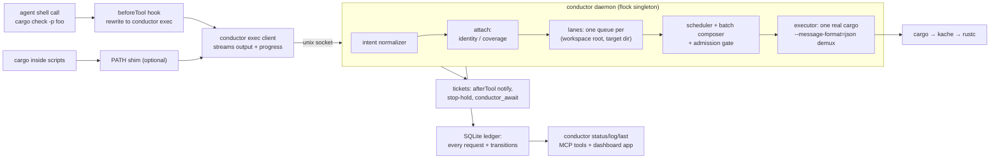

# cargo-conductor

cargo-conductor is an [agent-bundle](https://github.com/ScriptedAlchemy/agent-bundle)
plugin that puts a broker daemon between coding agents (Claude Code, Codex CLI,
Cursor) and `cargo`. A `beforeTool` hook rewrites each agent's cargo shell call
into a brokered request; the daemon deduplicates, schedules, and executes the
work, then streams output back so the agent sees a normal cargo run.

Agents keep running plain `cargo …`; the broker does the rest.

## The problem

Mined from Cursor/Codex/Claude session archives for one 49-crate Rust
workspace, Jun–Aug 2026:

- ~73,000 agent cargo invocations, all sharing one target dir across worktrees.
- ~45,600 "Blocking waiting for file lock" events; peak 33 concurrent cargo
  processes; 91% of Cursor cargo runs started while another was in flight.
- Massive redundancy: Cursor alone re-ran 12,783 identical command+cwd pairs
  within 15 minutes — 96% of them near-simultaneous parallel-subagent
  duplicates of a run already in flight.
- The work is slow enough to matter: check p50 ~3 min, build p50 ~11 min.
  Claude's shell tool killed 106 builds at its hard timeout, some of which
  were passing.
- Agents hand-rolled mitigations that make it worse: `CARGO_TARGET_DIR`
  isolation on 29% of commands (defeats sharing), 6,197 `ps`/`pgrep` probes,
  87+ `pkill cargo`.

The broker replaces lock contention with a queue, duplicate runs with
attachment, and blind waiting with tickets and status surfaces.

## How it works



Every request is normalized into an intent (subcommand, package set, targets,
features, profile, toolchain, env digest, workspace root, resolved target
dir), ledgered, and then served one of three ways:

- **Attach.** A request whose normalized intent is byte-identical to an
  in-flight run becomes a follower: the leader's buffered output is replayed,
  live output is mirrored, and the exit is shared — this is aimed at the 96%
  duplicate storm. A strictly weaker `cargo check` can also ride a stronger
  in-flight `build`/`check` over the same compile surface and a covering
  package set (coverage riding), with only the diagnostics for its own scope.
- **Merge.** The batch composer folds queued compatible `check`/`build`/
  `clippy` requests with explicit `-p` lists into the leader's single cargo
  invocation (up to 16 packages). The executor runs cargo with
  `--message-format=json-diagnostic-rendered-ansi` and demultiplexes per-unit
  results back to each requester. Riders with `--lib`-scoped demands are
  released early, as soon as the stream proves their packages compiled cleanly
  (or shows them failing); broader demands settle with correct per-scope
  results when the composite run completes.
- **Queue and run.** One lane per (workspace root, target dir) — the daemon is
  the only cargo runner on managed paths, which alone ends the lock storms. A
  cost scheduler picks the next job by score: shortest-job-first, divided by
  waiter fan-out (runs that release the most agents win) and topological
  unblocks (leaf crates before their dependents, warming the artifacts the
  dependents reuse), halved for recently-edited crates (fail fast), and decayed
  by age (every 30s waited halves the effective score, so broad builds are
  never starved). Estimates come from the daemon's own per-intent EWMA, seeded
  from ledger history, falling back to kache `index.db` per-crate compile-time
  priors, then to mined-p50 defaults. Admitted runs get a `CARGO_BUILD_JOBS`
  grant that splits the machine's cores between them, and a machine-wide
  admission gate caps concurrent cargo processes (default 5).

## Tickets and long builds

Every request gets a durable ticket (`cc-<n>`) in the SQLite ledger; results
(status, exit code, output tail, timings) survive daemon restarts and are
retrievable cross-session.

- `conductor exec --bg -- cargo …` (or the `conductor_request` MCP tool)
  returns the ticket immediately.
- Sync runs auto-background when the priors-based ETA exceeds the host's
  shell-timeout cap (~9 min for Claude, 10 for Codex, 14 for Cursor), instead
  of getting killed mid-build.
- The `afterTool` hook notifies: on the agent's next tool call after a ticket
  finishes, it injects context like `ticket cc-42 finished: success, 0 errors —
  call conductor_result cc-42`.
- `conductor_await <ticket>` long-polls; `conductor_result <ticket>` fetches
  the durable result.
- Stop-hold: when an agent tries to stop with pending tickets, the `stop` hook
  waits up to min(remaining ETA, `CARGO_CONDUCTOR_STOP_WAIT_MS`) and then
  denies the stop — with the result summary if something finished, otherwise
  with status + ETA and an escape hatch ("stop again to keep waiting or call
  conductor_await"). The re-deny loop makes the total wait unbounded without
  any marathon hook process; `stopHookActive` plus a per-ticket deny cap (8)
  prevents livelock. Background tickets never hold the stop.

## Install

Build the bundle once (`npm install && npm run build`); `artifact/plugin` is
the installable multi-host bundle. Per host:

- **Cursor** — symlink into the local plugins directory:

  ```sh
  ln -s "$(pwd)/artifact/plugin" ~/.cursor/plugins/local/cargo-conductor
  ```

- **Claude Code**:

  ```sh
  claude plugin marketplace add ./artifact/plugin
  claude plugin install cargo-conductor@cargo-conductor-marketplace
  ```

- **Codex CLI**:

  ```sh
  codex plugin marketplace add ./artifact/plugin
  codex plugin add cargo-conductor@cargo-conductor-marketplace
  ```

- **Optional PATH shim** — hooks cannot see cargo spawned inside shell
  scripts; the shim catches those:

  ```sh
  conductor install-shim --dir ~/.local/bin --real-cargo "$(command -v cargo)"
  ```

See [docs/install.md](docs/install.md) for per-host hook details and Codex
timeout fallbacks.

## Surfaces

The `conductor` CLI ships inside every host artifact (`scripts/conductor.mjs`)
and as the package bin:

| Command | What it does |
| --- | --- |
| `conductor exec [--session ID] [--host HOST] [--cwd DIR] [--bg] -- <cargo …>` | Run cargo through the daemon, streaming output back (the hook rewrites to this form) |
| `conductor status [--limit N]` | Queue, in-flight work, lanes, admission |
| `conductor log [--limit N]` | Recent requests from the durable ledger |
| `conductor last` | The most recent request |
| `conductor await <ticket> [--max-wait-ms N]` | Long-poll a ticket until it finishes or the wait expires |
| `conductor result <ticket>` | Fetch a durable ticket result |
| `conductor request [--session ID] [--cwd DIR] -- <cargo …>` | Submit a background request, returning a ticket |
| `conductor daemon <run\|start\|stop\|status>` | Daemon lifecycle |
| `conductor install-shim [--dir DIR] [--real-cargo PATH] [--force]` | Install the optional PATH cargo shim |

The same operations project to MCP tools on the `conductor` server:

| MCP tool | What it does |
| --- | --- |
| `conductor_status` | Daemon queue and in-flight work (renders the dashboard widget) |
| `conductor_log` | Recent requests from the ledger |
| `conductor_last` | The most recent request |
| `conductor_await` | Long-poll a ticket |
| `conductor_result` | Fetch a durable ticket result |
| `conductor_request` | Submit a background cargo request |

The MCP App dashboard (`ui://cargo-conductor/dashboard.html`, bound to
`conductor_status`, refreshed every 5s) shows contention stats with an
admission meter, per-lane queues, in-flight work, the queue with attach chips,
and a history timeline — including what each request actually ran as when the
batch composer expanded it. Status and log surfaces keep working from the
ledger when the daemon is down.

## Configuration

All settings are environment variables read by the daemon (and hooks):

| Variable | Default | Meaning |
| --- | --- | --- |
| `CARGO_CONDUCTOR_STATE_DIR` | `/fast/cache/cargo-conductor` | Home of the unix socket, SQLite ledger, daemon log, pid lock, and `hook-events.jsonl` |
| `CARGO_CONDUCTOR_MAX_CONCURRENT` | `5` | Machine-wide cap on concurrently running cargo processes (admission permits) |
| `CARGO_CONDUCTOR_REPLAY_BUFFER_BYTES` | `4194304` | Leader output retained in memory for late-attacher replay |
| `CARGO_CONDUCTOR_KACHE_INDEX` | `/fast/cache/kache/index.db` | kache index for per-crate compile-time priors (empty string disables) |
| `CARGO_CONDUCTOR_JOBS_GRANT` | `max(4, cores / max concurrent)` | `CARGO_BUILD_JOBS` injected into each spawned cargo (`0` disables; caller-set `-j`/env wins) |
| `CARGO_CONDUCTOR_BATCH` | enabled | Set to `0` to disable the batch composer |
| `CARGO_CONDUCTOR_STOP_WAIT_MS` | `30000` | Bounded wait per stop-hold hook invocation |

## Guarantees and caveats

- **Fail-open everywhere.** Hook errors pass the original command through; if
  the daemon is unreachable the client tries to auto-spawn it once, then runs
  cargo directly (passthrough). Missing kache data or topology failures
  degrade to defaults, never to errors.
- **Test execution is never shared** except between byte-identical runs:
  `test`/`nextest`/`bench` coalesce only at identity; coverage riding is
  limited to `check` under an in-flight `build`/`check`.
- **Failed-stronger rule.** A failed or killed stronger run never satisfies a
  coverage or batch follower — the follower is requeued to run on its own.
  The one exception is proven per-unit success: if the JSON stream shows the
  follower's packages compiled cleanly before an unrelated unit failed, the
  follower is released as done.
- **Denied and attempted runs are recorded.** Hook rewrites and policy denials
  (`cargo clean` while builds are in flight) append to `hook-events.jsonl`
  under the state dir; malformed cargo commands get a failed ledger row.
- **Codex stop-hook timeout honoring is unverified** on Codex 0.147. The
  bounded-wait design tolerates being cut off; see
  [docs/install.md](docs/install.md) and [docs/codex-hooks.md](docs/codex-hooks.md).
- Requires Node >= 22.19 (`node:sqlite` without native deps). Daemon state
  lives under `/fast/cache/cargo-conductor` by default.

## Development

```sh
npm run dev     # agent-bundle workbench with live rebuilds (portable target)
npm run check   # validate + build + typecheck + rstest — the merge gate
```

agent-bundle has no npm release yet; this repo pins the
[pkg.pr.new](https://pkg.pr.new) preview of main SHA
[`560124af`](https://github.com/ScriptedAlchemy/agent-bundle/commit/560124af).
Compile targets are `plugin` (one bundle for Claude, Codex, and Cursor) and
`portable` (workbench playground); see `agent-bundle.config.ts` for why the
per-host target names are not listed individually (AB6017).
