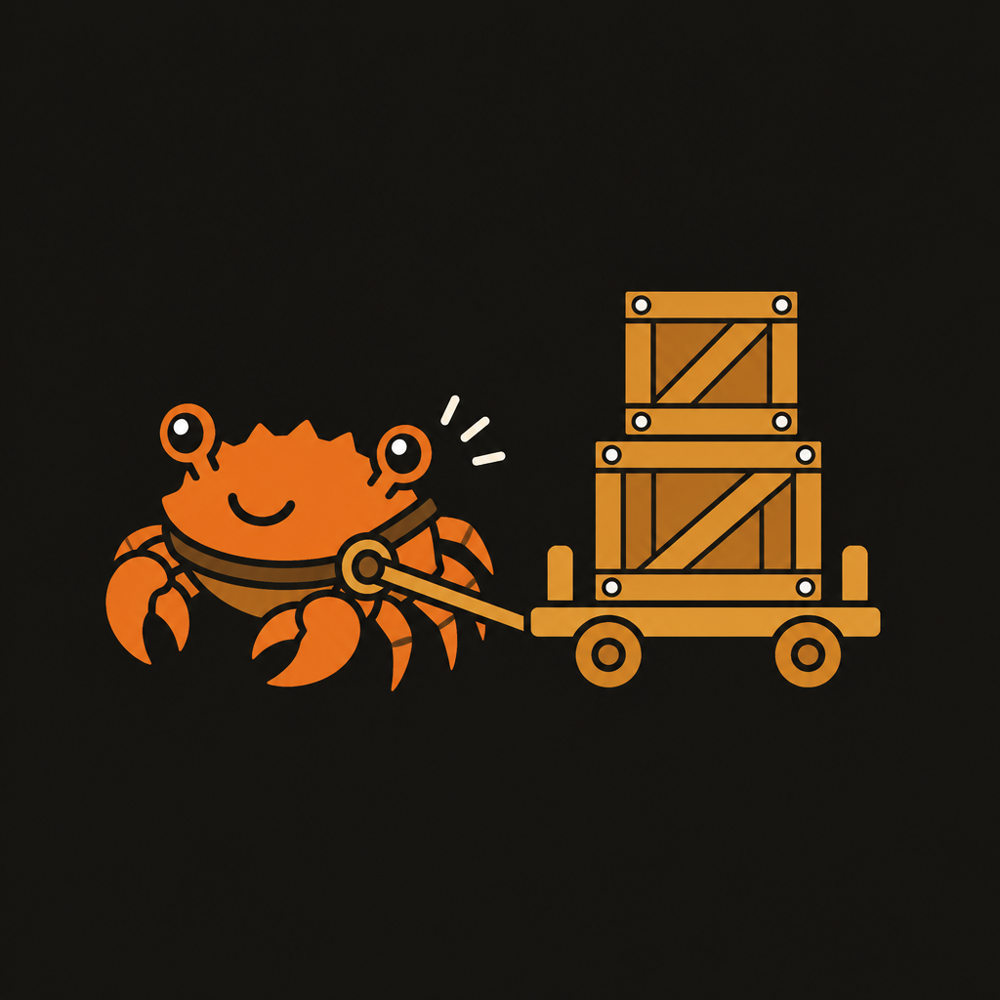
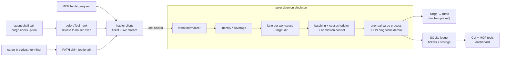

<p align="center"></p>

# cargo-hauler

**Stop your AI agents from fighting over cargo.**

cargo-hauler brokers Rust builds across Claude Code, Codex, Cursor, scripts,
and terminals. Agents keep running normal `cargo …` commands; one daemon
coalesces duplicate work, controls machine pressure, and streams the result
back to every rider.


## The problem

Put several coding agents in one Rust codebase and they behave like strangers:
they all start the same checks, block on Cargo's locks, thrash CPU and I/O, and
sit blind during long builds. Splitting `CARGO_TARGET_DIR` makes the lock
message disappear by paying for the same compilation several times.

This is not hypothetical. A real 96-core fleet machine recorded:

| Live deployment signal | Observed |
| --- | ---: |
| Cargo runs brokered in 24 hours | **782** |
| Compile compute avoided | **7h 42m** |
| Agent latency saved | **3h 37m** |
| Duplicate/compatible riders served | **138** |

The run count is the dashboard's rolling 24-hour window. Savings and riders
are all-time, ledger-backed totals captured from the same deployment; negative
latency riders are included rather than hidden.

The workload that motivated cargo-hauler was already severe: one 49-crate
workspace produced about 73,000 agent Cargo invocations and 45,600
`Blocking waiting for file lock` events in three months. Cursor alone repeated
12,783 identical command-and-directory pairs within 15 minutes.

## How it works in 60 seconds

Three entry points intercept Cargo without changing how agents work:
`beforeTool` hooks rewrite shell calls, an optional PATH shim catches Cargo
inside scripts and terminals, and MCP clients submit work through
`hauler_request`. Every request becomes a durable ticket.

The daemon normalizes the command into an intent, then:

1. **Identity attaches** byte-identical requests to one in-flight run.
2. **Coverage attaches** a narrower check to a compatible stronger compile.
3. **Batch folding** combines compatible queued compile or test requests.
4. **Admission control** uses machine load, CPU/I/O pressure (PSI), and a
   concurrency ceiling before starting more work.
5. **Cost-aware scheduling** learns per-intent EWMA timings and can seed new
   estimates from kache's per-crate history.

One real Cargo process streams output to all attached agents. During quiet
compile phases, silence-gated heartbeats keep host tools informed without
flooding their context. The SQLite ledger records every transition and keeps
two separate, honest savings numbers: compute not run and rider latency saved.
Both can be negative when sharing cost more than it helped.



## Built for an agent fleet

| Capability | What changes |
| --- | --- |
| Work sharing | Identical work attaches; covered checks ride; compatible compile and test requests fold. |
| Pressure-aware admission | Load, PSI, active lanes, and the configured ceiling decide when another Cargo process is safe. |
| Learned scheduling | Intent EWMA and optional kache crate costs prioritize short, high-fan-out work without starving broad builds. |
| Durable observability | Tickets, output, timings, outcomes, and savings survive daemon restarts in SQLite. |
| Normal Cargo UX | Live output, buffered replay, quiet-period heartbeats, and the final exit code flow back to each caller. |

### Metrics across the windows that matter

The dashboard separates 1-hour, 24-hour, and all-time populations. Run and
wait percentiles stay windowed; savings remain all-time ledger accounting.


### Kache intelligence

When [kache](https://github.com/ScriptedAlchemy/kache) is present,
cargo-hauler reads its machine-wide index for first-run cost priors and shows
the slowest crates by profile. Without kache, the daemon falls back to its own
EWMA history and the panel simply disappears.


### Live tickets instead of blind waits

Open any active ticket to see its current output tail. The drawer refreshes
while the run is live; completed results remain available from the ledger.


## Quickstart: the first five minutes

Requirements: Node 22.19 or newer, Cargo, and Linux or macOS.

```sh
npm install
npm run build
```

`artifact/plugin` is the installable multi-host bundle:

```sh
# Claude Code
claude plugin marketplace add ./artifact/plugin
claude plugin install cargo-hauler@cargo-hauler-marketplace

# Codex CLI
codex plugin marketplace add ./artifact/plugin
codex plugin add cargo-hauler@cargo-hauler-marketplace

# Cursor
./scripts/install-cursor.sh
```

Cursor needs a restart so new sessions load the hooks. Start or inspect the
daemon with the shipped CLI (shown as `hauler` below):

```sh
hauler daemon start
hauler status
```

The first brokered request auto-starts the daemon. Hooks cover direct agent
shell calls; install the optional PATH shim to catch Cargo inside scripts and
ordinary terminals:

```sh
hauler install-shim --dir ~/.local/bin
```

MCP App-capable hosts render the dashboard from
`ui://cargo-hauler/dashboard.html`. For a plain browser:

```sh
node scripts/preview-dashboard.mjs --port 4941
```

See [docs/install.md](docs/install.md) for host-specific details.

## Honest limits

- **Linux and macOS are supported.** Windows named-pipe support is
  experimental; the POSIX PATH shim is unavailable and jobserver integration
  is disabled there.
- **Host integration is built with
  [agent-bundle](https://github.com/ScriptedAlchemy/agent-bundle).** The
  generated artifact is the supported Claude Code, Codex, and Cursor delivery
  path.
- **Sharing preserves declared semantics, not wishful equivalence.** Failed
  stronger compile runs requeue dependents, and folded tests intentionally
  share the composite exit code.
- **Licensed under MIT.**

## Tickets and long builds

Every request gets a durable ticket (`cc-<n>`) in the SQLite ledger; results
(status, exit code, output tail, timings) survive daemon restarts and are
retrievable cross-session.

- `hauler exec --bg -- cargo …` (or the `hauler_request` MCP tool)
  returns the ticket immediately.
- Sync runs auto-background when the priors-based ETA exceeds the host's
  shell-timeout cap (~9 min for Claude, 10 for Codex, 14 for Cursor), instead
  of getting killed mid-build.
- The `afterTool` hook notifies: on the agent's next tool call after a ticket
  finishes, it injects context like `ticket cc-42 finished: success, 0 errors —
  call hauler_result cc-42`.
- `hauler_await <ticket>` long-polls; `hauler_result <ticket>` fetches
  the durable result.
- Stop-hold: when an agent tries to stop with pending tickets, the `stop` hook
  waits up to min(remaining ETA, `CARGO_HAULER_STOP_WAIT_MS`) and then
  denies the stop — with the result summary if something finished, otherwise
  with status + ETA and an escape hatch ("stop again to keep waiting or call
  hauler_await"). The re-deny loop makes the total wait unbounded without
  any marathon hook process; `stopHookActive` plus a per-ticket deny cap (8)
  prevents livelock. Background tickets never hold the stop.

## PATH shim details

The generated shim embeds absolute paths for both the hauler CLI and the real
Cargo binary (resolved at install time, never through PATH again), tags its
submissions with `--host shim`, and passes daemon-spawned Cargo straight
through to the real binary so the broker never re-enters itself.

## kache is optional

The broker never requires kache. Without it, scheduling estimates come from
the daemon's own EWMA over ledger history (plus mined-p50 defaults for
never-seen intents) and the dashboard
simply omits the machine-wide cache panel. With kache installed, its
`index.db` seeds per-crate compile-time priors, so the very first run of an
intent gets a real estimate instead of a default. A missing index is reported
as "kache unavailable", never an error.

## Surfaces

The `hauler` CLI ships inside every host artifact (`scripts/hauler.mjs`)
and as the package bin:

| Command | What it does |
| --- | --- |
| `hauler exec [--session ID] [--host HOST] [--cwd DIR] [--bg] -- <cargo …>` | Run cargo through the daemon, streaming output back (the hook rewrites to this form) |
| `hauler status [--limit N]` | Queue, in-flight work, lanes, admission |
| `hauler log [--limit N]` | Recent requests from the durable ledger |
| `hauler last` | The most recent request |
| `hauler await <ticket> [--max-wait-ms N]` | Long-poll a ticket until it finishes or the wait expires |
| `hauler result <ticket>` | Fetch a durable ticket result |
| `hauler request [--session ID] [--cwd DIR] -- <cargo …>` | Submit a background request, returning a ticket |
| `hauler daemon <run\|start\|stop\|status>` | Daemon lifecycle |
| `hauler install-shim [--dir DIR] [--real-cargo PATH] [--force]` | Install the optional PATH cargo shim |

The same operations project to MCP tools on the `hauler` server:

| MCP tool | What it does |
| --- | --- |
| `hauler_status` | Daemon queue and in-flight work (renders the dashboard widget) |
| `hauler_log` | Recent requests from the ledger |
| `hauler_last` | The most recent request |
| `hauler_await` | Long-poll a ticket |
| `hauler_result` | Fetch a durable ticket result |
| `hauler_request` | Submit a background cargo request |

The MCP App dashboard (`ui://cargo-hauler/dashboard.html`, bound to
`hauler_status`, loaded immediately and then refreshed every 5s) stacks
full-width sections in the order contention → in flight → queue → metrics →
kache → lanes → history. Contention shows daemon state, queue depth, and an
admission meter. Metrics switch between 1-hour, 24-hour, and all-time
populations while savings stay all-time and ledger-backed.
In-flight and queued rows show the workspace, who submitted (host · session),
and elapsed or waiting time against the cost-model estimate
("2m 18s / ~13m 11s"). Lanes lists only lanes with work — queued or running —
counted as "3 active · 7 seen"; idle lanes clear on daemon restart. History
lists only finished (done, failed, or killed) runs, including what each
request actually ran as when the batch composer expanded it. Commands render
the bare program name (`cargo test …`) with the full binary path in the hover
tooltip. Status and log surfaces keep working from the ledger when the daemon
is down.

## Configuration

All settings are environment variables read by the daemon (and hooks):

| Variable | Default | Meaning |
| --- | --- | --- |
| `CARGO_HAULER_STATE_DIR` | per-user cache dir (see below) | Home of the unix socket, SQLite ledger, daemon log, pid lock, and `hook-events.jsonl` |
| `CARGO_HAULER_CARGO_BIN` | `$CARGO_HOME/bin/cargo` | Real cargo binary for daemon-spawned work (bare `cargo` as last resort); the daemon never resolves `cargo` through PATH, where the shim may sit |
| `CARGO_HAULER_MAX_CONCURRENT` | `5` | Machine-wide cap on concurrently running cargo processes (admission permits) |
| `CARGO_HAULER_REPLAY_BUFFER_BYTES` | `4194304` | Leader output retained in memory for late-attacher replay |
| `CARGO_HAULER_KACHE_INDEX` | kache's own configured store (see below) | kache index for per-crate compile-time priors (empty string disables; a missing file just reports kache as unavailable) |
| `CARGO_HAULER_JOBS_GRANT` | `max(4, cores / max concurrent)` | `CARGO_BUILD_JOBS` injected into each spawned cargo (`0` disables; caller-set `-j`/env wins) |
| `CARGO_HAULER_BATCH` | enabled | Set to `0` to disable the batch composer |
| `CARGO_HAULER_BATCH_WINDOW_MS` | `150` | Brief hold for a batchable lane head so near-simultaneous agent requests can fold (`0` disables) |
| `CARGO_HAULER_STOP_WAIT_MS` | `30000` | Bounded wait per stop-hold hook invocation |

For a non-breaking rebrand, each `CARGO_HAULER_*` setting takes precedence
over its legacy `CARGO_CONDUCTOR_*` alias; existing operator environments
continue to work while they migrate.

Daemon state defaults to a per-user cache directory: `$XDG_CACHE_HOME/cargo-hauler`
when `XDG_CACHE_HOME` is set, otherwise `~/.cache/cargo-hauler` on Linux,
`~/Library/Caches/cargo-hauler` on macOS, and `%LOCALAPPDATA%\cargo-hauler`
on Windows. Set `CARGO_HAULER_STATE_DIR` to move it (e.g. onto a RAM disk);
no machine-specific mount is ever required.

When `CARGO_HAULER_KACHE_INDEX` is unset, the kache index resolves to
`<local_store>/index.db` where `local_store` is read from kache's own config
(`$XDG_CONFIG_HOME/kache/config.toml`, else `~/.config/kache/config.toml`,
`[cache]` section); if no config exists, it falls back to
`<user cache>/kache/index.db` under the same cache base as above. kache is
optional either way — see [kache is optional](#kache-is-optional).

## Guarantees and caveats

- **Fail-open everywhere.** Hook errors pass the original command through; if
  the daemon is unreachable the client tries to auto-spawn it once, then runs
  cargo directly (passthrough). Missing kache data or topology failures
  degrade to defaults, never to errors.
- **Test sharing is identity or fold, never coverage.** `test`/`nextest`/
  `bench` coalesce between byte-identical runs, and queued compatible `test`/
  `nextest` requests can fold into one composite run whose full output and
  exit code every participant shares — a failed ticket can mean a co-batched
  crate's tests failed, not yours, so read the composite output before
  re-running. Coverage riding stays limited to `check` under an in-flight
  `build`/`check`.
- **Failed-stronger rule (compile work).** A failed or killed stronger run
  never satisfies a coverage or compile-batch follower — the follower is
  requeued to run on its own. The one exception is proven per-unit success:
  if the JSON stream shows the follower's packages compiled cleanly before an
  unrelated unit failed, the follower is released as done. Folded test
  participants sit outside this rule by design: they share the composite's
  exit code.
- **Denied and attempted runs are recorded.** Hook rewrites and policy denials
  (`cargo clean` while builds are in flight) append to `hook-events.jsonl`
  under the state dir; malformed cargo commands get a failed ledger row.
- **Codex stop-hook behavior is verified on Codex 0.147.0** (live probe:
  holds of ~29s and ~72s ran to their own wait bound and denied intact; hook
  trust must be granted or bypassed for hooks to run at all). Budgets above
  ~72s are plausible but unmeasured; the bounded-wait design tolerates being
  cut off either way. See [docs/codex-hooks.md](docs/codex-hooks.md).
- Requires Node >= 22.19 (`node:sqlite` without native deps). Linux and macOS
  are supported. Windows transport is experimental; the POSIX shell shim is
  unavailable and jobserver integration is disabled there. Daemon state lives
  under the per-user cache dir by default (`CARGO_HAULER_STATE_DIR` overrides;
  see [Configuration](#configuration)).

## Development

```sh
npm run dev     # agent-bundle workbench with live rebuilds (portable target)
npm run check   # validate + build + typecheck + rstest — the merge gate
```

### Preview the dashboard in a browser

```sh
node scripts/preview-dashboard.mjs --port 4941
```

Serves the built dashboard (`artifact/plugin/mcp-apps/dashboard.html`) at
`http://127.0.0.1:4941` outside any MCP host: a small harness answers the
widget's MCP App messages with live `hauler status` output, so the page
shows real daemon data with the same 5s polling. Run `npm run build` first —
the harness reads the artifact, not the sources.

`repos/effect` vendors the Effect v4 source (subtree pinned to
`effect@4.0.0-rc.112`) as read-only reference for coding agents — it is not a
runtime dependency; see `AGENTS.md`.

agent-bundle has no npm release yet; this repo pins the
[pkg.pr.new](https://pkg.pr.new) preview of main SHA
[`b3c12f316`](https://github.com/ScriptedAlchemy/agent-bundle/commit/b3c12f316).
Compile targets are `plugin` (one bundle for Claude, Codex, and Cursor) and
`portable` (workbench playground); see `agent-bundle.config.ts` for why the
per-host target names are not listed individually (AB6017).
